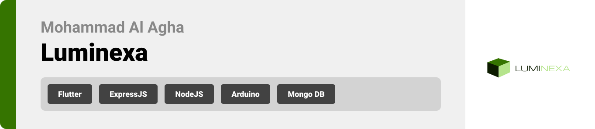

<br><br>

<!-- project philosophy -->


> A mobile app that allows the users to control the room's lighting using Arduino.
>
> Luminexa aims to give the users a full control over their lighting systems with high flexibilty and variety of lighting modes and themes to choose from. The only limit is the creativity of the user.

### User Stories

- As a user, I want to control the the intensity(increase/decrease) of the light and not only the state(On/Off) of it so I can have a full control on every single spot light in the room.
  -As a user, I want to get notified when there is no one in the room with the lights on so that I can approve/reject the permission to shut down the light
- As a user, I want to create my own schedule and set time so that the lights can be turned on or off automatically and based on the schedule I made.
- As a user, I want to set different light modes in the room so that I can match it with the event I have.
- As a user, I want the system to be adaptive to the light that is coming from outside so that it asks me for a permission to turn off/decreases the light when it is sunny and increases the light when it is cloudy.
- As a user, I want benefit from an already built in energy saving mode that I can activate when needed.
- As a user, I want to be able to login/sign up.
- As a user, I want to add new system connection to my account.
- As a host, I want to be able to turn off all schedules so that I don’t have to worry about the lights automatically going on when I am out on a vacation for example.
- As a host, I want to view the power consumption statistics of the lighting system in each room.
- As a host, I want to be able to shut down the whole system in case of an emergency.
- As a host, I want to be able to add new hosts so that they can help me.
- As a host, I want to be able to add/remove normal users.
- As a host, I want to be able to view all normal users so that I know who I want to delete or promote to a host.

<br><br>

<!-- Prototyping -->
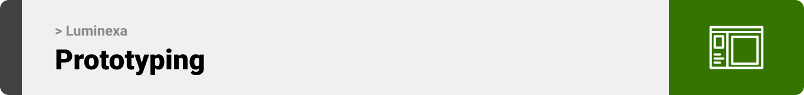

> We designed Luminexa using wireframes and mockups, iterating on the design until we reached the ideal layout for easy navigation and a seamless user experience.

### Wireframes

| Login screen                          | Register screen                     | Landing screen                    |
| ------------------------------------- | ----------------------------------- | --------------------------------- |
| 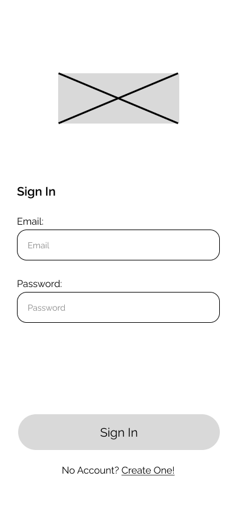 | 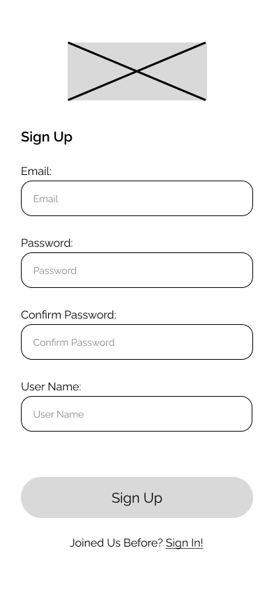 | 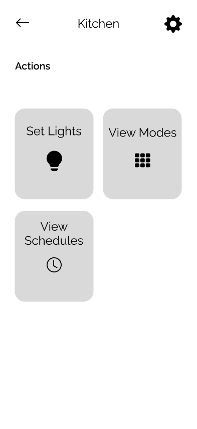 |

### Mockups

| Login screen                                | Register Screen                           | Home Screen                             |
| ------------------------------------------- | ----------------------------------------- | --------------------------------------- |
| 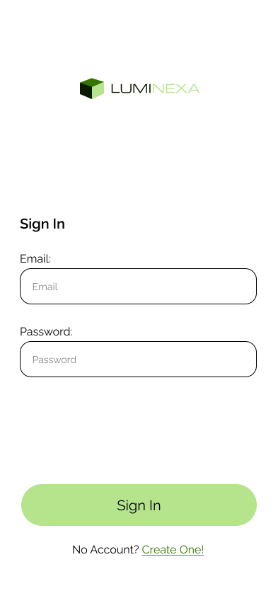 | 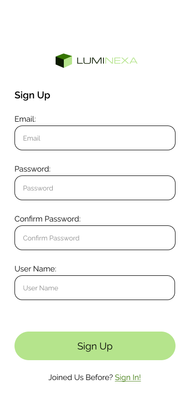 | 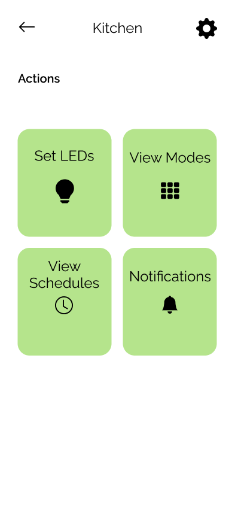 |

<br><br>

<!-- Implementation -->


> Using the wireframes and mockups as a guide, we implemented the Luminexa app with the following features:

### User Screens (Mobile)

| Login screen                    | Register screen                      | Landing                        |
| ------------------------------- | ------------------------------------ | ------------------------------ |
| 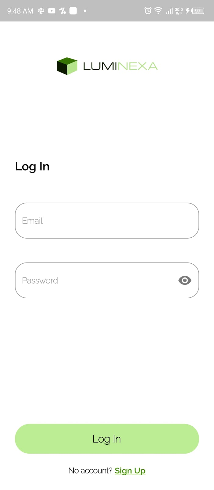  | 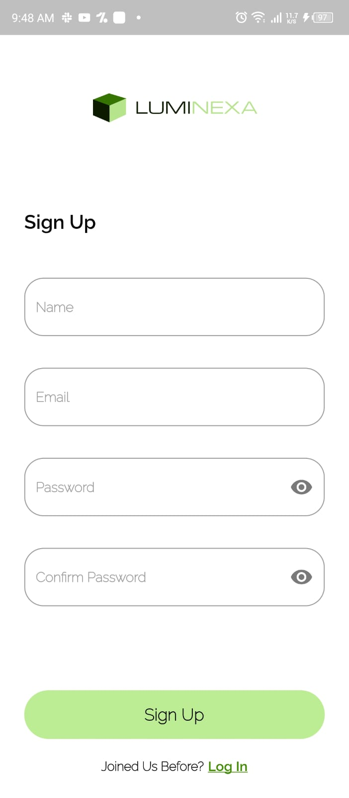        | 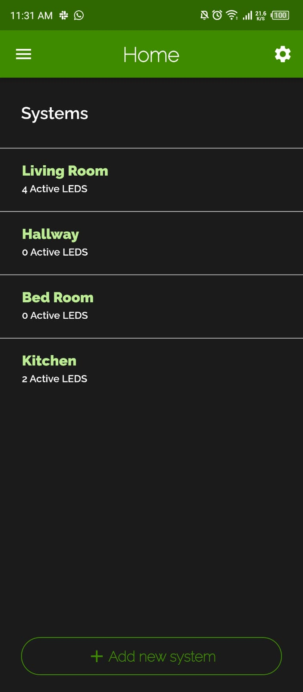    |
| Home screen                     | Notifications Screen                 | Weather Screen                 |
| 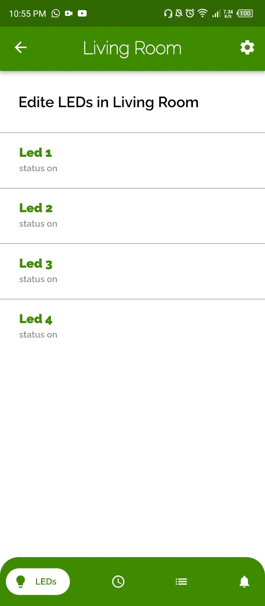 | 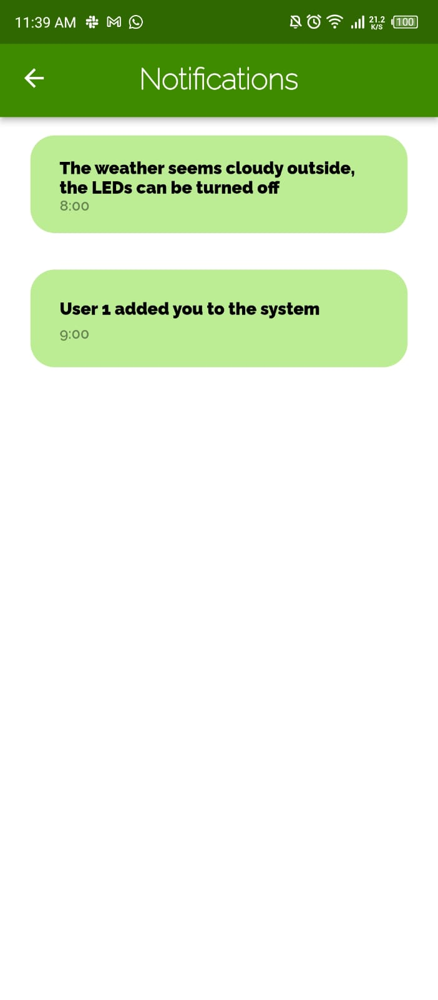 | 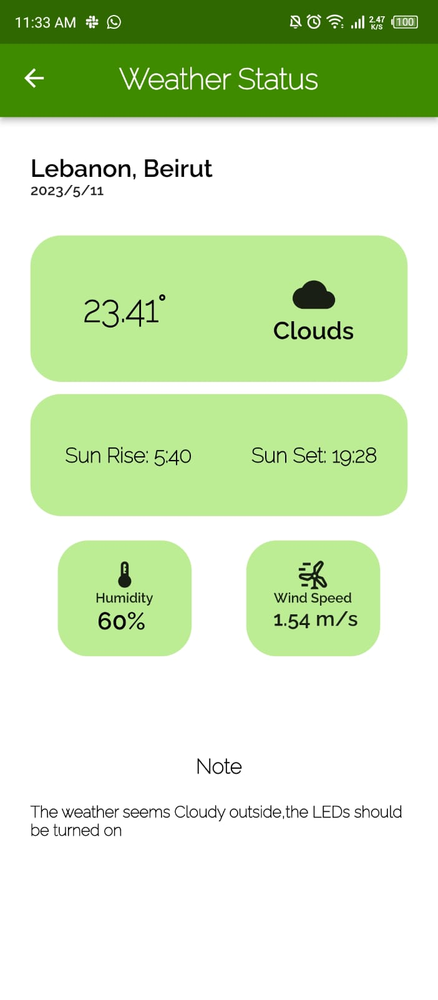 |

### Host Screens (Web)

| Users screen                   | Consumption screen           | Landing screen                    |
| ------------------------------ | ---------------------------- | --------------------------------- |
| 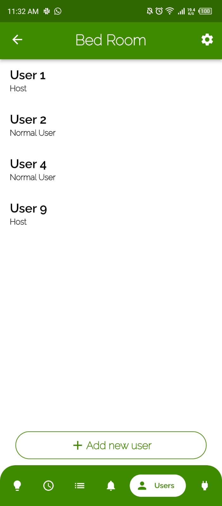 | 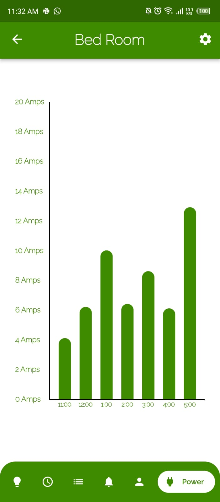 | 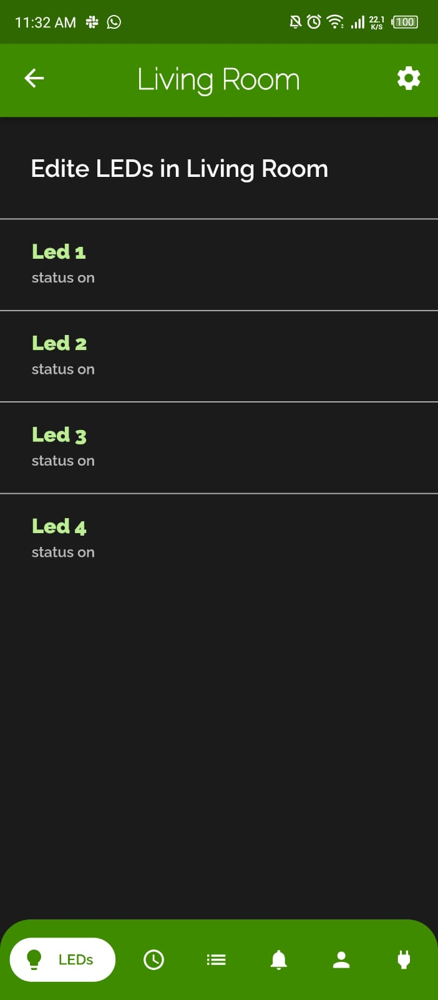 |

<br><br>

<!-- Tech stack -->


### Luminexa is built using the following technologies:

- This project uses the [Flutter app development framework](https://flutter.dev/). Flutter is a cross-platform hybrid app development platform which allows us to use a single codebase for apps on mobile, desktop, and the web.
- To send local push notifications, the app uses the [flutter_local_notifications](https://pub.dev/packages/flutter_local_notifications) package which supports Android, iOS, and macOS.
- The app uses the font ["Raleway"](https://fonts.google.com/specimen/Work+Sans) as its main font, and the design of the app adheres to the material design guidelines.

<br><br>

<!-- How to run -->


> To set up Luminexa locally, follow these steps:

### Prerequisites

This is an example of how to list things you need to use the software and how to install them.

- npm
  ```sh
  npm install npm@latest -g
  ```

### Installation

_Below is an example of how you can instruct your audience on installing and setting up your app. This template doesn't rely on any external dependencies or services._

1. Clone the repo
   ```sh
   git clone https://github.com/MohammadAlAgha/luminexa.git
   ```
2. Install NPM packages
   ```sh
   npm install
   ```
3. Run the server
   ```sh
   nodemon .
   ```
4. Install Flutter SDK
5. Go to luminxe_mobile directory
   ```sh
   cd luminexa_mobile
   ```
6. Install pub packages
   ```sh
   flutter pub get
   ```
7. Run luminexa_mobile
   ```sh
   flutter run
   ```

Now, you should be able to run Luminexa locally and explore its features.
